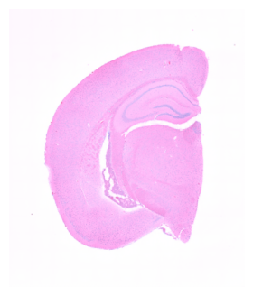
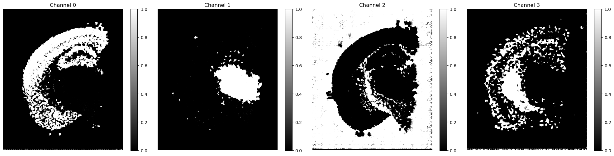
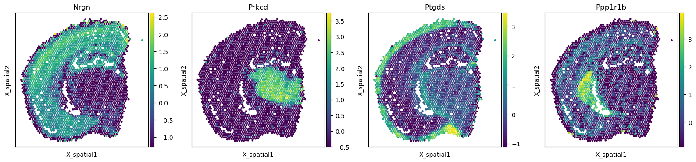
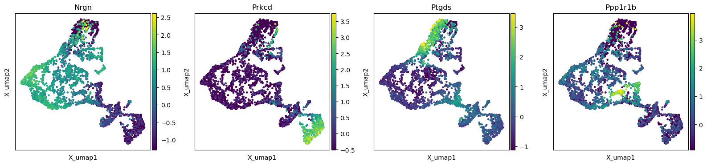

# VisumHistologyReconstruction
 A quick attemp to project spatial gene expression profiles onto tissue images as if it were a protein immunofluorescence imaging

## RESULTS
Reconstructed Tissue Image 
   
Gene Expression Projected onto tissue image 
   
True Gene Expression 
   
Gene Expresssion on UMAP 

## Explanation 
### The Problem
10x Visium data is a spatial gene expression sequencer
- data is in the form of 2x2 micron regions that are treated as cells
- the resulting data points are gene expression values and x, y spatial coordinates
- Associated with the coordinates is a tissue image that the coordinates correspond to.

- The problem is this is not truly single cell data and the tissue image has clear cellular resolution that is more detailed than the 2x2 micron square.  
- Can we generate a gene expression profile on top of the tissue image?

### The Approach 
A 2 component neural network that first reconstructs the tissue image in pretraining using a convolutional neural network, then assigns gene expression values to every pixel as an extension of the final convolutional layer. 
**Data Preparation**
- Collected 2 Visium mouse brain datasets. Each dataset was preprocessed by removing cells with < 200 genes and removing genes expressed in less than 3 cells. Cells with total counts>30000 were also removed and then cell expression counts were normalized to a total of 10,000.  
**Exploration** 
- Data structure was explored by running pca, knn, leiden, and umap to view unsupervised clustering of cells. The top 4 genes per cluster were extracted and the top 1 gene per cluster was used in the model training. 
**Integration** 
- Exploring cross dataset integration showed that there is a high degree of batch effect between the two datasets of the same tissue type (possible from different degrees of posterior/anterior coronal slices).  
- Comparing the spatial representation also shows the 2 slices were centered well but there is slight variation in the size and shape. 
		
### Model Architecture
- Encoder: Compresses an RGB image through four convolutional layers with ReLU and max-pooling, reducing spatial dimensions by 16x and producing a 128-channel feature map.
- Decoder: Reconstructs the image and predicts gene expression by upsampling the latent representation through four transposed convolutional layers, outputting 3 RGB channels plus num_genes gene channels.
- Pretraining is run only reconstructing the tissue image with no gene expression loss, then gene expression loss is included to reconstruct genes on the tissue image. 
**Loss** 
- SSIM Loss was chosen for image reconstruction as opposed to MSE because while MSE reconstructs the image with higher accuracy, when combined with gene reconstruction the image is averaged to all white pixels. The SSIM loss however is built around preserving structure and prevents the loss cheating at image reconstruction to favor gene reconstruction. 
- Gene expression loss was calculated by averaging the gene expression across a spatial 2x2 micron square on comparing it to the true gene expression value of the spatial pseudocell. Then MSE across all. 
### Limitations
- Need histology images with protein staining to serve as ground truth for gene expression on image structures. From this a cell demultiplexing model could be added to explore how single cells are partially combined into the 2 micron pseudocells which could then be fed into a diffusion model to inflate the 2 micron squares to the higher pixel resolution of the tissue image.
- Not explored for generalizability across datasets and tissue types.
### Future Direction
- Grid search hyperparameters to explore what variations cause the model to perform best. 
- Explore feature detection and attention based image models so the tissue structure may vary across samples and still be reconstructed with high accuracy.
- Incoorperate several datasets to assess generalizability across sequncing batchs, tissue types, and slight variations in dissection
- Add complexity to the gene reconstruction model (independent of spatial information)
